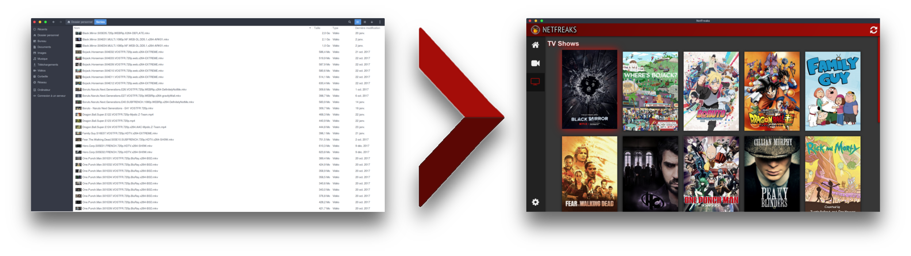

<p align="center">
  
  <h1> NetFreaks Pages</h1>
  <h3> Free Media Center cross platform under GPLv3 </h3>
  
  Turns your media folder into a Media Center
</p>

## Realeses

Coming soon

## Manual Installation

  ```bash
    git clone https://github.com/Gabfranck/NetFreaks.git
    cd NetFreaks
    npm install
  ```

  "MainFolder" is optional, it will be set at first launch

  Get api key [here](http://www.omdbapi.com/)

###  Run it

  ```bash
    npm start
    # or
    npm run dev #( dev mode with hot reload )
  ```

  (tested with node 7.10.1 and npm 5.6.0)

## Licence

NetFreaks - Media Center under GPLv3

Copyright (C) 2018  Gabriel Franck

This program is free software: you can redistribute it and/or modify
it under the terms of the GNU General Public License as published by
the Free Software Foundation, either version 3 of the License, or
(at your option) any later version.

This program is distributed in the hope that it will be useful,
but WITHOUT ANY WARRANTY; without even the implied warranty of
MERCHANTABILITY or FITNESS FOR A PARTICULAR PURPOSE.  See the
GNU General Public License for more details.

You should have received a copy of the GNU General Public License
along with this program.  If not, see <https://www.gnu.org/licenses/>.
